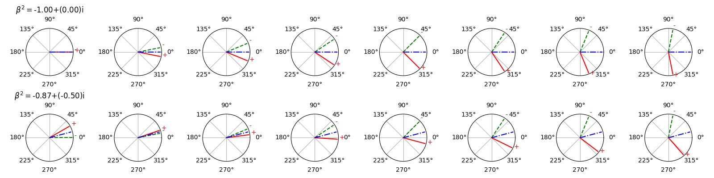

# Multidimensional RF pulse design using auto-differentiable spin-domain optimization for reduced field-of-view imaging

This repository provides code to simulate the spin-domain rotation and design multidimensional RF pulse in spin-domain for magnetic resonance imaging. The simulation is built using auto-differentiation in Pytorch. 
And demos for designing 3D refocusing and 3D excitation pulses are provided. 
For running large experiments, it would be better use GPU for speed.

One major benefit of this project: first, we are able to optimize a 3D reofcusing pulse based on spin-domain representation, which simplifies the design problem. We also demonstrated the possibility of desiging 3D excitation pulse based spin-domain representation. Second, our simulation function was implemented with derived Jacobian, which speed up the evaluation of derivatives for the optimization updates.

The manuscript related to this project:<br>
Multi-Dimensional RF Pulse Design Using Auto-Differentiable Spin-Domain Optimization for Reduced Field-of-View Imaging, 2024, Jiayao Yang, Jon-Fredrik Nielsen, Jeffrey A. Fessler, Yun Jiang

(The output figures may not look exactly the same as in the manuscript, since the they are re-plotted in Matlab.)

## General description
**My running environment**
- Ubuntu 22.04.5 LTS
- Python 3.10.12
- Pytorch 2.3.1
- Cuda 11.3 (for GPU)
- and other necessary python packages

Example B0 and B1 maps, and initial pulses are provided under
```
data
├── phantom_b0_1.mat
├── phantom_b0_2.mat
├── phantom_b0_3.mat
├── phantom_b0_4.mat
├── phantom_b1_1.mat
├── phantom_b1_2sim.mat
├── phantom_b1_3sim.mat
├── phantom_mask.mat
├── pulse_init_3d.mat
└── pulse_init_spins_4ms.mat
```

## Demos
**Demo of designing 3D refocusing and 3D excitation pulses:**<br>
The python scripts are `demo_refocusing.py` and `demo_excitation.py`. More details can be found in these two functions.
- download the project
- go to the project folder
- in the terminal, run the script `bash experiments_demo.sh` (make sure your python/virtual environment has required packages)
- the results should be saved in `outputs/refocusing_demo` and `outputs/excitation_demo`


## Experiments
**Design 3D refocusing and 3D excitation pulse.** 
A shell script that runs all the experiments with different setups is
```sh
bash experiments.sh
```

The following are some additional experiments for further demonstration. 


**3D refocusing pulse optimization using SPINS initialization.**<br>
```sh
bash experiments_additiaonl.sh
```

**Compare performance of the implemented simulator.**<br>
The scripts are provided by `simulation_efficiency.py` and `simulation_effi.sh`. <br>
To run the experiments run `bash simulation_effi.sh`, the results will be saved to assigned folder.


**How transverse magnetization rotate with different spin-domain parameters**:<br>
To demostrate how is the transverse magnetization affected by different spin-domain parameters. 
The experiment is `illustration_transverse_rotation.py`. 
It considered different value of $\beta^2$ with norm equals 1 produces the rotation in transverse plane. For example, green denotes the initial transverse magnetization, red denotes the rotated magnetization, and blue denotes the computed rotation axis from them. 


## Acknowledgements
This work is inspired by and takes reference of
- https://github.com/tianrluo/AutoDiffPulses
- https://github.com/mikgroup/sigpy


---
note: the `mritools` is a package that includes modules for defining objects, simulation functions, and pulse optimization. This is part of the package the author also used for other different projects. But necessary functions are remained for running experiments and optimizations. The full package might be released later.
