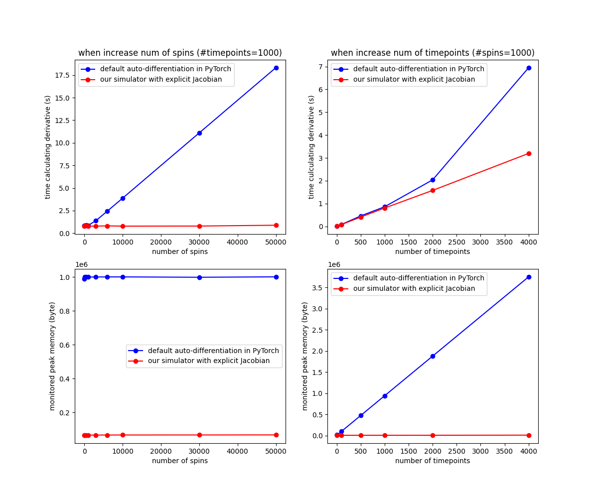
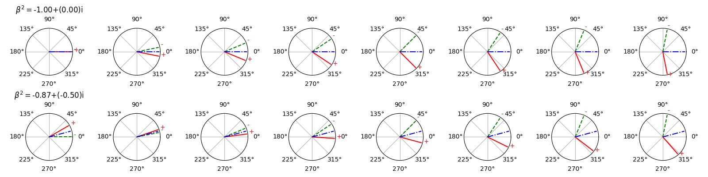

# MRIPulse
**Multidimensional RF pulse design in spin-domain using auto-differentiation**

author: Jiayao

This repository provides code to simulate the spin-domain rotation and design multidimensional RF pulse in spin-domain for magnetic resonance imaging. The simulation is built using auto-differentiation in Pytorch. And demo for designing a 3D refocusing pulse is provided. For running large experiments, it would be better to use GPU and have enough memory.

(The output figures may not look exactly the same as in the paper, since the figures in the paper are plotted by: first save the results, and re-read and plot in Matlab.)

## Environment
My running environment
- Ubuntu 20.04.4 LTS
- Python 3.9.10
- Pytorch 1.10.2+cu113
- Cuda 11.3 (for GPU)
- Matplotlib
- Numpy

## Preliminaries

## General description
The basic functions for describing the spin behaviors and simulations including spin-domain simulation are provided in `mri.py`. Other files provided different utilities, and a breif description is as follows.
- `mri.py`: provides definition of basic class, e.g. `Spin`, `SpinArray`, `Pulse`, `Signal`. It also provides simulation functions (e.g., Bloch simulation, spin-domain simulation) with self-implemented autodifferentiation.
- `mriopt.py`: provides solver for optimizing the object loss function. 

## Demos
**Demo: design of 3D refocusing pulse**
- The object, ROI, optimization parameters are already set in the code, but you are welcome to look into the `demo_Design3dRefocusing.py` and make more changes beyond the following demo.
1. Running design 3D refocusing pulse with inhomo B0 and B1 maps
    - run `python demo_Design3dRefocusing.py --b0map 1 --b1map 1 --outpulse 'pulse_opt_log_1.mat'`
    - (the shape, ROI, optimization parameters are already specified in the python codes)
    - (the inhomogeneous maps are already specified in the python codes, i.e., `init_B0map_modified.mat` and `init_B1map_modified.mat`)
2. Running design 3D refocusing pulse without B0 and B1 maps (assuming homogeneous)
    - run `python demo_Design3dRefocusing.py --b0map -1 --b1map -1 --outpulse 'pulse_opt_log_2.mat'`
- The initial pulse used is designed using https://github.com/toppeMRI/ZoomedMRI/tree/master

## Additional experiments
- Compare methods for calculating derivative (for spin-domain simulation): 
  - The experiment is `EX_simu_compare.py`
  - Two simulators are compared, one is only build forward computation, another is our implementation with both forward and backward function. The backward function is explicitly implemented in Pytorch using auto-differentiation. 
  - Two things are compared for the performance: one is the time for computing derivative (when fixed 1000 timepoints of pulse), another is the monitered peak memory usage (when fixed 1000 spins).
  - 
- How transverse magnetization rotate with different spin-domain parameters:
  - The experiment is `EX_transverse_rotation_illustration.py`. 
  - Considered different value of $\beta^2$ with norm equals 1 produces the rotation in transverse plane. For example, green denotes the initial transverse magnetization, red denotes the rotated magnetization, and blue denotes the computed rotation axis from them.
  - 

## Acknowledgements
This work is inspired by and takes reference of
- https://github.com/tianrluo/AutoDiffPulses
- https://github.com/mikgroup/sigpy
