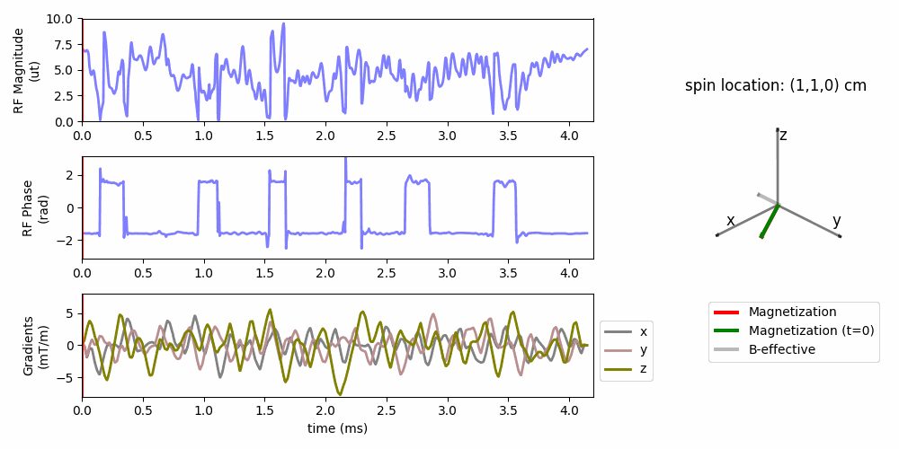

# Multidimensional RF pulse design using auto-differentiable spin-domain optimization and its application to reduced field-of-view imaging

This repository provides code to simulate RF pulse using the spin-domain representation, and optimize multidimensional RF pulses for MRI. 

The simulation function is built using auto-differentiation in Pytorch for computation efficiency. 

And demos for designing 3D refocusing and 3D excitation pulses are provided. 
For running large experiments, it would be better to use GPU for speed.




[paper: Multidimensional RF pulse design using auto-differentiable spin-domain optimization and its application to reduced field-of-view imaging](https://doi.org/10.1002/mrm.30607)

## Installation 
Recommend installing with python virtual environment: e.g., [https://docs.python.org/3/library/venv.html](https://docs.python.org/3/library/venv.html)

Recommend installing the pytorch with CUDA first: [https://pytorch.org/](https://pytorch.org/).
Then install the package as described below:

Download the repository or use the command line 
```
git clone https://github.com/MIITT-MRI-Jianglab/Multid_RF_SpinDomain.git
```

Option 1: install as a package if you just want to use the functions
```
pip install .
```

Option 2: if you want to make your modifications to the codes, then in the examples, you should change/add the path to the package by yourself.

## Demos
Some demos are provided for understanding the usage of functions
- Simulate RF pulse using spin-domain simulation function
    - [demo1_spindomain_simulation](demos/demo1_spindomain_simulation.ipynb)
- Calculating gradients (derivative) for optimization 
    - [demo2_calculating_derivatives](demos/demo2_calculating_derivatives.ipynb)

## Experiments
### 3D refocusing/excitation pulse optimization
- The python file `design_3dpulses.py` provided example of 3D excitation and 3D refocusing pulse optimization. 


### Simulators  
Compare simulator performance with explicit Jacobian and with default Jacobian operation. 
- run `bash simulator_perf.sh`, the results will be saved under `outputs/simulator`
- then run `python simulator_perf_plot.py` to plot the results


## Citation 
Paper: https://doi.org/10.1002/mrm.30607

If you find this helpful to your work, please consider cite our work:
```
@article{yang2025multidimensional,
    title={Multidimensional RF pulse design using auto-differentiable spin-domain optimization and its application to reduced field-of-view imaging},
    author={Yang, Jiayao and Nielsen, Jon-Fredrik and Fessler, Jeffrey A and Jiang, Yun},
    journal={Magnetic Resonance in Medicine},
    year={2025},
    publisher={Wiley Online Library}
}
```

## Acknowledgements
This implementation of this study was inspired by the following sources, which were used as references:
- https://github.com/tianrluo/AutoDiffPulses
- https://github.com/mikgroup/sigpy
- https://github.com/toppeMRI/ZoomedMRI/tree/master/RFdesign 
